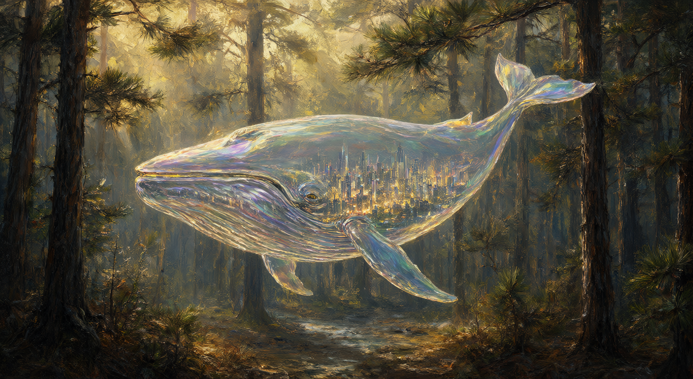
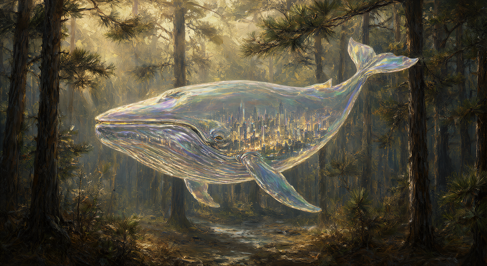
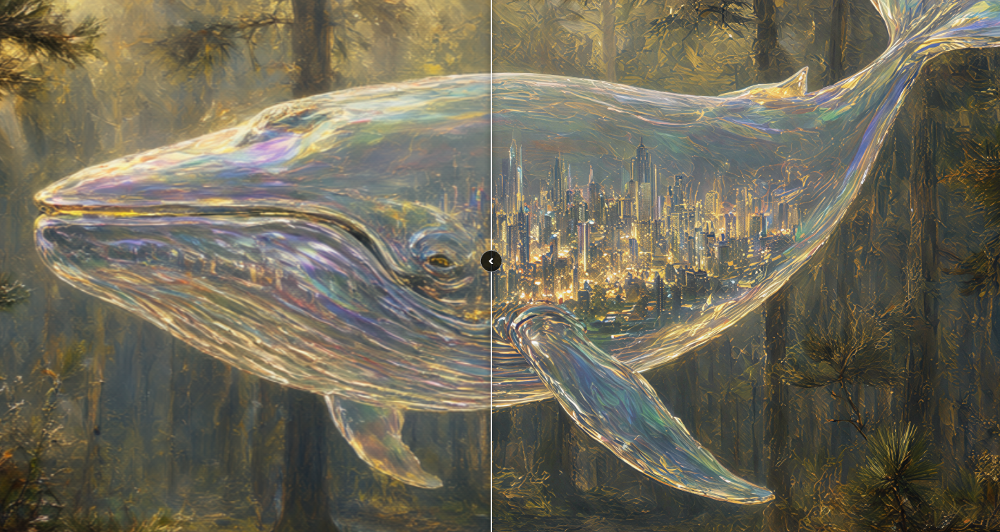
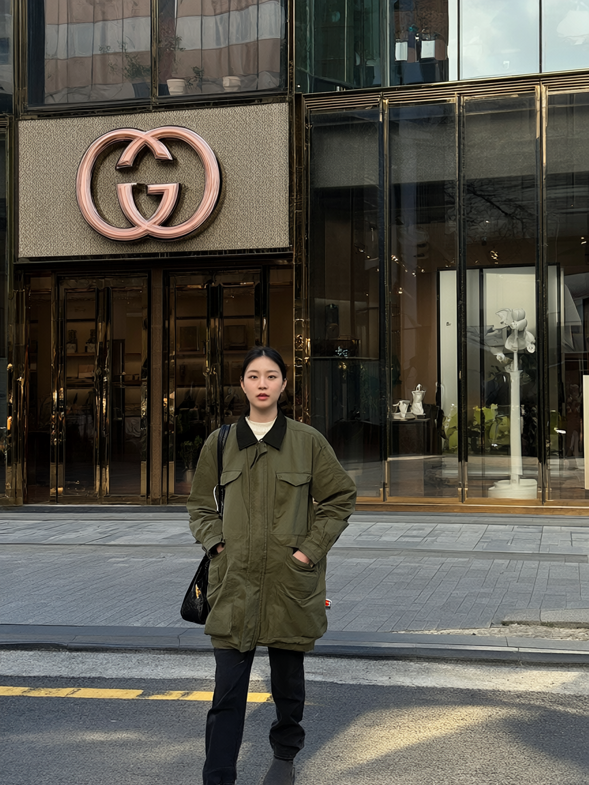
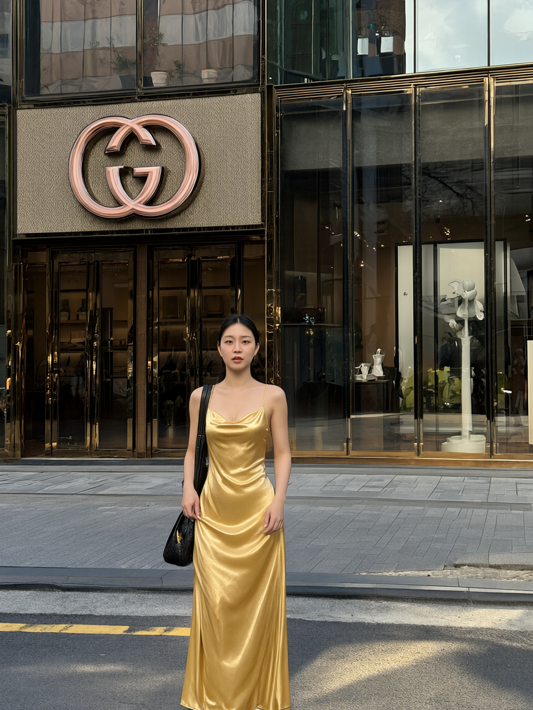

# not-so-jarvis

**JARVIS — a local AI assistant dashboard that runs entirely on your machine.**

Chat, generate images, edit photos, produce videos with sound, design UGC ads, and invent characters — all driven from one conversational UI. Built with **plain Node.js** (zero npm dependencies) and **vanilla HTML/CSS/JS** (no bundler, no build step). No cloud, no accounts, no telemetry.


## Contents

- [Features](#features)
- [Requirements](#requirements)
- [Quick start](#quick-start)
- [First-run setup](#first-run-setup)
- [How it works](#how-it-works)
- [Architecture](#architecture)
- [Development](#development)
- [License](#license)

## Features

Everything runs from a single chat surface — there are no separate tools or dashboards.

### Chat

- **Ollama chat** with SSE token streaming, markdown rendering, and persisted conversation history
- **Context builder** that assembles a bounded prompt (system prompt + rolling summary + recent messages)
- **Task router / ActiveTask** — remembers the active image or video session across turns, so *"make the sky darker"* or *"another one"* keeps working without restating context
- **`@` image references** — type `@` in the composer to attach earlier generated images as references; questions use them as vision input, instructions route to a multi-reference edit, and video wording routes to image-to-video
- **Voice input** — push-to-talk dictation via the browser Web Speech API (optional auto-send)
- **Spoken replies** — read JARVIS replies aloud via the SpeechSynthesis API, with voice selection and rate control
- **Live machine, weather & news awareness** — ask about your CPU/GPU/VRAM, the weather, or the news and the assistant is given a gated live snapshot (system telemetry + Open-Meteo + RSS headlines) as context, so it answers with real values and real sources instead of guessing

### Image generation

- **Text-to-image** via Krea2 (default) or Qwen Image 2.1 on a local ComfyUI instance — the chat LLM acts as a "visual director" that enriches your prompt before the workflow runs
- **LoRA stack** — attach multiple LoRAs with per-LoRA strength, on/off toggle, and automatic trigger words
- **Image upscaling** — SeedVR2 (tiled diffusion) or Ultimate SD, with a before/after compare viewer

<p align="center">
  <br>
  <sub><em>Prompt: generate image A surrealist oil painting of a giant whale floating through a dense pine forest instead of water. The whale is made of iridescent glass, and inside its body, a miniature glowing city is visible. Soft golden sunlight filters through the trees, casting long shadows</em></sub>
</p>
<p align="center">
  <br>
  <sub><em>Prompt: upscale this image</em></sub>
</p>
<p align="center">
  <br>
  <sub><em>Built-in image comparison when an image gets upscaled</em></sub>
</p>

### Image edit

- **Instruction editing** with Qwen Image 2.1 — attach a photo (or say *"edit this image"*) and describe the change; JARVIS re-stages, recolors, adds, or removes objects while preserving the rest
- **Multi-reference editing** — attach several images and address each by position (*"make image 1 hold image 2 at image 3"*)
- Edited files carry an `_edit_` marker and keep the source untouched

<table align="center">
  <tr>
    <td align="center" valign="top" width="50%">
      <br>
      <sub><em>Before</em></sub>
    </td>
    <td align="center" valign="top" width="50%">
      <br>
      <sub><em>Prompt: change her outfit to golden silky dress</em></sub>
    </td>
  </tr>
</table>

### Video generation

- **Video generation** with MiniMax H3 — text-to-video-audio (T2VA) and image-to-video-audio (I2VA), with synchronized audio
- **Director Mode** — multi-stage productions (brief → opening image approval → H3 video) with contextual direction changes and film-style shot lists
- **Long Video Director** — videos beyond H3's 15-second ceiling, planned as a continuous, motion-consistent beat chain rendered in one job
- **FaceRefine** — optional second H3 pass that tracks faces per frame, re-generates them at low denoise, and stitches them back to fix small or distant faces
- **Video upscaling** — fast RTX super-resolution (default) or the SeedVR2 quality path, audio-preserving

<p align="center">
  <video src="screenshots/video.mp4" width="72%" controls muted loop playsinline></video><br>
  <sub><em>MiniMax H3 — text-to-video with synchronized audio</em></sub>
</p>

https://github.com/user-attachments/assets/e74c3178-ad92-42bf-a1ca-4f68efde6897

> **Audio note.** Locally the preview above is muted — open [`screenshots/video.mp4`](screenshots/video.mp4) directly to hear the synchronized audio. On GitHub, the attachment player plays with audio.

### UGC Studio

- **Chat-first UGC workflow** — ask for a TikTok-style ad and the studio walks the whole production: brief, product, creator, creative direction, script, scenes, reference frames, then the final video
- **Facts-only scripts** — never invents product claims, ingredients, certifications, or testimonials; uses only what you or the Product Library supply
- **Product Library** — reusable product records with reference images
- **Director handoff** — approved scenes and every approved reference frame continue into the existing Director pipeline

### Creative Playground

- **Surprise Me** — deterministic concept discovery that invents a scene, a character and a look without touching the GPU until you hit Generate
- **Character generator** — independent appearance × age × gender controls over structured trait pools; a fresh character pre-renders its face so you meet them before the scene
- **Themes, techniques & outfits** — lifestyle/candid, experimental photography and more, composing outfits, environments and activities
- **Outfit Packs** — 10 wardrobe personalities (plus custom) that compose a concrete, coherent outfit while never changing who the person is
- **Locks & iteration** — pin an identity, outfit or scene, then re-roll or modify only what you want to change

### Dashboard & tooling

- **System monitoring** — live CPU, RAM, and VRAM/GPU widgets (via `nvidia-smi`) with draggable, reorderable canvas history charts
- **ComfyUI widget** — live generation status, progress bar, and queue information
- **Weather widget** — browser geolocation + Open-Meteo; no API key required
- **News widget** — keyless RSS headlines (BBC, NPR, Hacker News by default, or your own feeds) with ALL / GLOBAL / LOCAL scopes; set a local area and the LOCAL scope searches it. Every headline links out to the source, and asking *"what's the news about X?"* or *"local news"* in chat answers from the same live headlines
- **Model library** — browse, download, load, unload, and remove models with hardware-compatibility detection
- **Generated gallery** — thumbnails, full-grid view, preview lightbox with zoom/pan, grouped upscales, and before/after compare
- **First-run setup guide** — Settings > Setup checks your ComfyUI install, downloads missing models from Hugging Face, and installs missing custom nodes
- **Settings panel** — provider, chat, image, upscale, video, and system configuration with search

### Engineering

- **Zero dependencies** — even `.env` loading, markdown parsing, PNG dimension reading, and the HTTP routing are hand-rolled
- **No framework** — a Node `http` server plus a vanilla JS frontend
- **Single generation lock** — one image or video job at a time, with queued jobs cancellable from chat

## Requirements

- **Node.js** — no `npm install` needed (zero dependencies)
- **NVIDIA GPU with 16 GB VRAM is required** to run the full image, video, and upscale stack (Krea2, MiniMax H3, SeedVR2). VRAM is freed and reloaded between chat and generation as needed via `vram-manager`.
- **[Ollama](https://ollama.com)** running at `localhost:11434` for chat
- **Optional, for image/video/upscale:** [ComfyUI](https://github.com/comfyanonymous/ComfyUI) with the Krea2 / MiniMax H3 models and custom nodes. The in-app **Settings > Setup** guide can install these for you.

> **Reference machine.** Developed and tested on **16 GB VRAM + 64 GB system RAM**. 64 GB of system RAM is recommended for video upscaling, which holds the full source and the upscaled output in memory (see [Upscaling](#upscaling)).

## Quick start

```bash
npm start
```

Or use the launcher for your platform, which installs **Node.js LTS** for you if it is missing and relaunches the server automatically when it exits with code `100` (used by Settings > System > Restart):

- **Windows** — double-click `start.bat`
- **macOS / Linux** — `bash start.sh`

Then open **http://localhost:3001**.

## First-run setup

If image or video features report missing pieces, open **Settings > Setup**:

1. Install and start **ComfyUI** (Desktop or portable), then start this server so the guide can detect it.
2. Create a free **Hugging Face** account, accept the **Krea 2 / MiniMax H3** model licenses, and paste a **read** access token (stored in `data/config.json`).
3. Click **Download all missing** — the model set is large (60 GB+), so leave it running.
4. Click **Install all missing** for custom nodes, then **restart ComfyUI**.

Green indicators mean each capability (image, video, upscale, edit) is ready to use.

## How it works

### Intent routing

Every message flows through `task-router.js` before any tool runs. The router decides whether to:

- **start a new task** (`image_generation`, `video_generation`),
- **continue or modify** the active task,
- **answer a question** about the active task, or
- **just chat**.

A fast regex signal decides whether a structured LLM classifier is needed; the classifier's JSON is the authority on execution — the chat model's free-text reply never triggers a tool. Deterministic pre-LLM gates own narrow intents (upscaling, typo-tolerant phrasings, bare *"again"*, anaphoric *"another image"*, explicit new-generation requests) so small chat models cannot downgrade them to chat. Classification runs at temperature 0.

When a tool does run, VRAM is freed first (`vram-manager` unloads the chat model to make room), the workflow is queued, and results stream back into the conversation. Once the chat model is needed again, the image/video models are unloaded in turn. Unloads are verified rather than fire-and-forget: JARVIS polls Ollama until the chat model actually leaves memory (and holds a short settle for the OS to reclaim the RAM) before loading ComfyUI, so a still-resident `llama-server` can't be stacked under the video model.

### Environment awareness

Chat has no tools, so live machine state is injected as system context when relevant. A stats question (*"what's my GPU usage?"*) gets a gated CPU/RAM/GPU/VRAM telemetry snapshot; a weather question (*"will it rain today?"*) gets a live Open-Meteo snapshot for the location reported by the dashboard widget (stored in `data/config.json`); a news question (*"what's the news about AI?"*) gets the live RSS headlines, with a topic search when one can be extracted. "Local news" uses the saved local area; "world news" uses the configured feeds. The gates keep unrelated turns lean, and the prompt forbids estimating or inventing values, forecasts, or headlines.

### Image generation

1. Detect the image intent (two-level: regex signal → structured LLM classifier).
2. Enrich the prompt with the chat LLM as a visual director.
3. Build the text-to-image graph (Krea2 by default, or Qwen Image 2.1).
4. Submit to ComfyUI and wait, relaying step progress over SSE.
5. Download the output to `data/generated/` and show it inline.

### Image edit

Attach a photo and describe a change (*"remove the car"*), or say *"edit this image, make it night"* to edit the last generated image. JARVIS resolves the source (a fresh upload wins, otherwise the latest generated image), builds the Qwen Image 2.1 instruction-edit graph, and shows the result inline. Multiple `@` references are wired in as `image 1` … `image N`, so a single instruction can address each by position. Edited files carry an `_edit_` marker. Only explicit edit requests run the edit path — vague tweaks like *"change her dress"* are treated as full re-generations.

### Video generation

Text prompts (T2VA) or an attached/referenced image (I2VA) produce a MiniMax H3 video with synchronized audio. Director Mode turns a production into discrete stages (brief → opening image approval → video), and the Long Video Director plans >15 s requests as a continuous beat chain. If FaceRefine is enabled, a second pass refines faces before the final file is written. On first enable, the ComfyUI-side nodes and face detector are auto-installed in the background.

### Upscaling

One shared **UPSCALE** configuration applies to both media. Engine mapping is normalized per medium:

| Medium | Engines |
|--------|---------|
| Images | SeedVR2 or Ultimate SD (an RTX selection falls back to SeedVR2) |
| Videos | SeedVR2 or fast RTX (default; an Ultimate SD selection falls back to RTX) |

Say *"upscale this image"* or *"upscale this video"* (also *"make it higher res"*); the source is resolved from the conversation's last generated image or video. Upscaled images are grouped with their original in the gallery, where **Compare** opens a before/after slider. Video upscales replace the original file and report the before → after dimensions.

> **Memory note (4x video upscale).** With the RTX engine, choosing **4x** scales both dimensions by 4 — **16x the pixels** — so VRAM use and the downloaded file size rise sharply. A video upscale also reads the entire source into system RAM and holds the full upscaled output in memory before writing it. On a 16 GB card or a lower-RAM machine, prefer **2x** unless you have headroom, and drop the multiplier if ComfyUI runs out of memory. The SeedVR2 video path ignores the multiplier and targets the configured short-side resolution instead. The in-app UPSCALE panel shows a warning whenever 4x is selected with RTX (or Ultimate SD, which falls back to RTX for video).

### LoRA stack

Attach LoRAs from ComfyUI's available models. Each entry has an on/off toggle, a strength slider (0–2, default 1), and a trigger word that is prepended to the prompt automatically. Active LoRAs compose in order via chained `LoraLoader` nodes.

## Architecture

- **Zero dependencies** — an intentional constraint; `.env` loading, markdown, PNG probing, and routing are all hand-rolled.
- **No framework** — a Node `http` server with path-based routing in `server.js` plus a vanilla JS frontend.
- **Plain-object services** — backend modules export named functions; there are no classes except `system-monitor.js`.
- **JSON persistence** — config, conversations, task state, and generated history live in `data/`, rewritten on mutation.
- **Dual persistence** — conversations are also mirrored to the browser in IndexedDB for UI durability.
- **SSE streaming** — chat tokens, generation status (`queued`/`generating`), ComfyUI step progress, and final results all stream over Server-Sent Events.
- **Cancellable queue** — each job owns an `AbortController`; cancellation aborts the ComfyUI wait and interrupts the prompt.
- **VRAM orchestration** — chat and image/video models are unloaded from GPU memory as needed to fit the next job.
- **Auto-cleanup** — ComfyUI originals are deleted after download, upscale inputs are cleaned up, and deleting a conversation prunes its gallery entries.

## Development

Run the test suite (Node's built-in `node --test`, no dependencies):

```bash
npm test
```

Suites in `test/` cover the router and intent classifiers with the LLM/storage seams stubbed. Add positive **and** negative phrase cases when changing a router regex or gate.

See `AGENTS.md` for architecture notes and contribution constraints.

## License

not-so-jarvis is free software licensed under the **MIT License**. not-so-jarvis does not claim ownership of media users create.

```
MIT License

Copyright (c) 2026 not-so-jarvis

Permission is hereby granted, free of charge, to any person obtaining a copy
of this software and associated documentation files (the "Software"), to deal
in the Software without restriction, including without limitation the rights
to use, copy, modify, merge, publish, distribute, sublicense, and/or sell
copies of the Software, and to permit persons to whom the Software is
furnished to do so, subject to the following conditions:

The above copyright notice and this permission notice shall be included in all
copies or substantial portions of the Software.

THE SOFTWARE IS PROVIDED "AS IS", WITHOUT WARRANTY OF ANY KIND, EXPRESS OR
IMPLIED, INCLUDING BUT NOT LIMITED TO THE WARRANTIES OF MERCHANTABILITY,
FITNESS FOR A PARTICULAR PURPOSE AND NONINFRINGEMENT. IN NO EVENT SHALL THE
AUTHORS OR COPYRIGHT HOLDERS BE LIABLE FOR ANY CLAIM, DAMAGES OR OTHER
LIABILITY, WHETHER IN AN ACTION OF CONTRACT, TORT OR OTHERWISE, ARISING FROM,
OUT OF OR IN CONNECTION WITH THE SOFTWARE OR THE USE OR OTHER DEALINGS IN THE
SOFTWARE.
```
