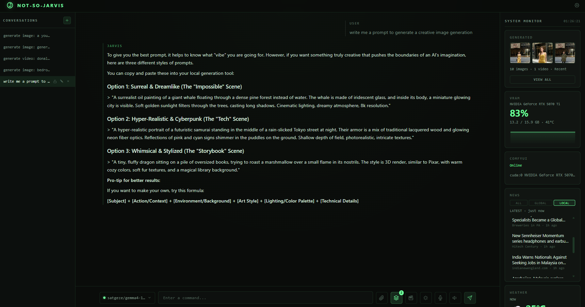

# not-so-jarvis

**JARVIS — a local AI assistant dashboard that runs entirely on your machine.**

Chat, generate images, edit photos, produce videos with sound, upscale both — all driven from one conversational UI. Built with **plain Node.js** (zero npm dependencies) and **vanilla HTML/CSS/JS** (no bundler, no build step). No cloud, no accounts, no telemetry.



## Contents

- [Features](#features)
- [Requirements](#requirements)
- [Quick start](#quick-start)
- [First-run setup](#first-run-setup)
- [How it works](#how-it-works)
- [Environment variables](#environment-variables)
- [Project structure](#project-structure)
- [Architecture](#architecture)
- [Development](#development)
- [License](#license)

## Features

### Chat & assistant

- **Ollama chat** with SSE token streaming, markdown rendering, and persisted conversation history
- **Context builder** that assembles a bounded prompt (system prompt + rolling summary + recent messages)
- **Task router / ActiveTask** — remembers the active image or video session across turns, so *"make the sky darker"* or *"another one"* keeps working without restating context
- **`@` image references** — type `@` in the composer to attach an earlier generated image as a reference; questions use it as vision input, instructions route to an identity edit, video wording routes to image-to-video
- **Voice input** — push-to-talk dictation via the browser Web Speech API (optional auto-send)
- **Spoken replies** — read JARVIS replies aloud via the SpeechSynthesis API, with voice selection and rate control
- **Live machine & weather awareness** — ask about your CPU/GPU/VRAM or the weather and the assistant is given a gated live snapshot (system telemetry + Open-Meteo) as context, so it answers with real values instead of guessing

### Image

- **Text-to-image** via Krea2 on a local ComfyUI instance — the chat LLM acts as a "visual director" that enriches your prompt before the workflow runs
- **Identity edit** — attach a photo (or say *"edit this image"*) and describe the change; the Krea2 Identity Edit LoRA re-stages, recolors, adds, or removes objects while preserving the rest
- **LoRA stack** — attach multiple LoRAs with per-LoRA strength, on/off toggle, and automatic trigger words
- **Image upscaling** — SeedVR2 (tiled diffusion) or Ultimate SD, with a before/after compare viewer

### Video

- **Video generation** with MiniMax H3 — text-to-video-audio (T2VA) and image-to-video-audio (I2VA), with synchronized audio
- **FaceRefine** — optional second H3 pass that tracks faces per frame, re-generates them at low denoise, and stitches them back to fix small or distant faces
- **Video upscaling** — fast RTX super-resolution (default) or the SeedVR2 quality path, audio-preserving

### Dashboard & tooling

- **System monitoring** — live CPU, RAM, and VRAM/GPU widgets (via `nvidia-smi`) with draggable, reorderable canvas history charts
- **ComfyUI widget** — live generation status, progress bar, and queue information
- **Weather widget** — browser geolocation + Open-Meteo; no API key required
- **Model library** — browse, download, load, unload, and remove models with hardware-compatibility detection
- **Generated gallery** — thumbnails, full-grid view, preview lightbox with zoom/pan, grouped upscales, and before/after compare
- **First-run setup guide** — Settings > Setup checks your ComfyUI install, downloads missing models from Hugging Face, and installs missing custom nodes
- **Settings panel** — provider, chat, image, upscale, video, and system configuration with search

### Engineering

- **Zero dependencies** — even `.env` loading, markdown parsing, PNG dimension reading, and the HTTP routing are hand-rolled
- **No framework** — a Node `http` server plus a vanilla JS frontend
- **Single generation lock** — one image or video job at a time, with queued jobs cancellable from chat

## Requirements

- **Node.js** — no `npm install` needed (zero dependencies)
- **[Ollama](https://ollama.com)** running at `localhost:11434` for chat
- **Optional, for image/video/upscale:** [ComfyUI](https://github.com/comfyanonymous/ComfyUI) with the Krea2 / MiniMax H3 models and custom nodes. The in-app **Settings > Setup** guide can install these for you.

## Quick start

```bash
npm start
```

Or use the launcher for your platform, which installs **Node.js LTS** for you if it is missing and relaunches the server automatically when it exits with code `100` (used by Settings > System > Restart):

- **Windows** — double-click `start.bat`
- **macOS / Linux** — `bash start.sh`

Then open **http://localhost:3001**.

## First-run setup

If image or video features report missing pieces, open **Settings > Setup**:

1. Install and start **ComfyUI** (Desktop or portable), then start this server so the guide can detect it.
2. Create a free **Hugging Face** account, accept the **Krea 2 / MiniMax H3** model licenses, and paste a **read** access token (stored in `data/config.json`; `HF_TOKEN`/`HUGGINGFACE_TOKEN` env vars override it).
3. Click **Download all missing** — the model set is large (60 GB+), so leave it running.
4. Click **Install all missing** for custom nodes, then **restart ComfyUI**.

Green indicators mean each capability (image, video, upscale, edit) is ready to use.

## How it works

### Intent routing

Every message flows through `task-router.js` before any tool runs. The router decides whether to:

- **start a new task** (`image_generation`, `video_generation`),
- **continue or modify** the active task,
- **answer a question** about the active task, or
- **just chat**.

A fast regex signal decides whether a structured LLM classifier is needed; the classifier's JSON is the authority on execution — the chat model's free-text reply never triggers a tool. Deterministic pre-LLM gates own narrow intents (upscaling, typo-tolerant phrasings, bare *"again"*, anaphoric *"another image"*, explicit new-generation requests) so small chat models cannot downgrade them to chat. Classification runs at temperature 0.

When a tool does run, VRAM is freed first (`vram-manager` unloads the chat model to make room), the workflow is queued, and results stream back into the conversation. Once the chat model is needed again, the image/video models are unloaded in turn.

### Environment awareness

Chat has no tools, so live machine state is injected as system context when relevant. A stats question (*"what's my GPU usage?"*) gets a gated CPU/RAM/GPU/VRAM telemetry snapshot; a weather question (*"will it rain today?"*) gets a live Open-Meteo snapshot for the location reported by the dashboard widget (stored in `data/config.json`). The gates keep unrelated turns lean, and the prompt forbids estimating or inventing values.

### Image generation

1. Detect the image intent (two-level: regex signal → structured LLM classifier).
2. Enrich the prompt with the chat LLM as a visual director.
3. Build the Krea2 text-to-image graph (UNET + CLIP + VAE + KSampler).
4. Submit to ComfyUI and wait, relaying step progress over SSE.
5. Download the output to `data/generated/` and show it inline.

### Identity edit

Attach a photo and describe a change (*"remove the car"*), or say *"edit this image, make it night"* to edit the last generated image. JARVIS resolves the source (a fresh upload wins, otherwise the latest generated image), builds the Krea2 identity-edit graph (UNET + Identity Edit LoRA + your LoRAs), and shows the result inline. Edited files carry an `_edit_` marker. Only explicit edit requests run the identity path — vague tweaks like *"change her dress"* are treated as full re-generations.

### Video generation

Text prompts (T2VA) or an attached/referenced image (I2VA) produce a MiniMax H3 video with synchronized audio. If FaceRefine is enabled, a second pass refines faces before the final file is written. On first enable, the ComfyUI-side nodes and face detector are auto-installed in the background.

### Upscaling

One shared **UPSCALE** configuration applies to both media. Engine mapping follows Mix Studio semantics:

| Medium | Engines |
|--------|---------|
| Images | SeedVR2 or Ultimate SD (an RTX selection falls back to SeedVR2) |
| Videos | SeedVR2 or fast RTX (default; an Ultimate SD selection falls back to RTX) |

Say *"upscale this image"* or *"upscale this video"* (also *"make it higher res"*); the source is resolved from the conversation's last generated image or video. Upscaled images are grouped with their original in the gallery, where **Compare** opens a before/after slider. Video upscales replace the original file and report the before → after dimensions.

### LoRA stack

Attach LoRAs from ComfyUI's available models. Each entry has an on/off toggle, a strength slider (0–2, default 1), and a trigger word that is prepended to the prompt automatically. Active LoRAs compose in order via chained `LoraLoader` nodes.

## Environment variables

Copy `.env.example` to `.env` and adjust as needed. Variables already set by the shell are not overwritten.

### Core

| Variable | Default | Purpose |
|----------|---------|---------|
| `PORT` | `3001` | Server port |
| `OLLAMA_URL` | `http://localhost:11434` | Ollama endpoint |
| `COMFYUI_URL` | `http://127.0.0.1:8188` | ComfyUI instance |
| `COMFYUI_TIMEOUT_MS` | `900000` | Generation timeout (15 min) |
| `VRAM_UNLOAD_THRESHOLD` | `80` | VRAM % that triggers model unloading |

### ComfyUI paths (usually auto-detected)

| Variable | Default | Purpose |
|----------|---------|---------|
| `COMFYUI_OUTPUT_DIR` | auto-detected | Output folder, for cleanup after download |
| `COMFYUI_ROOT` | auto-detected | ComfyUI install folder (contains `main.py`); used by the FaceRefine installer |
| `COMFYUI_MODEL_DIR` | auto-detected | ComfyUI `models/` folder, for upscale model discovery |
| `COMFYUI_INPUT_DIR` | auto-detected | ComfyUI `input/` folder, for uploaded-source cleanup |

### Krea2 image

| Variable | Default | Purpose |
|----------|---------|---------|
| `KREA2_UNET` | `krea2_turbo_fp8_scaled.safetensors` | UNET model |
| `KREA2_CLIP` | `Huihui-Qwen3-VL-4B-Instruct-abliterated-fp8_scaled.safetensors` | CLIP model |
| `KREA2_CLIP_TYPE` | `krea2` | CLIP type passed to ComfyUI |
| `KREA2_VAE` | `wan_2.1_vae.safetensors` | VAE model |
| `KREA2_EDIT_LORA` | `krea2_identity_edit_v1_2.safetensors` | Identity Edit LoRA |
| `KREA2_ASPECT_RATIO` | `4:5` | Default aspect ratio |
| `KREA2_IMAGE_SIZE` | `M` | Default size (S 0.75MP / M 1MP / L 1.75MP) |
| `KREA2_WIDTH`, `KREA2_HEIGHT` | derived | Explicit latent dimensions |
| `KREA2_STEPS` | `8` | KSampler steps |
| `KREA2_CFG` | `1` | KSampler CFG |

### Upscaling

| Variable | Default | Purpose |
|----------|---------|---------|
| `KREA2_SEEDVR2_DIR` | auto-detected | Directory of SeedVR2 DiT/VAE checkpoints |
| `COMFYUI_SEEDVR2_DIR` | auto-detected | Alternate SeedVR2 directory |

### Hugging Face

| Variable | Default | Purpose |
|----------|---------|---------|
| `HF_TOKEN` / `HUGGINGFACE_TOKEN` | — | Token for gated model downloads; overrides the token stored via Settings > Setup |

### MiniMax H3 video

| Variable | Default | Purpose |
|----------|---------|---------|
| `H3_UNET_T2VA` | `minimax_h3_fl2va_pruned_int8_convrot.safetensors` | UNET for text-to-video-audio |
| `H3_UNET_I2VA` | `minimax_h3_ref2va_pruned_int8_convrot.safetensors` | UNET for image-to-video-audio |
| `H3_VAE` | `minimax_h3_video_vae_fp16.safetensors` | Video VAE |
| `H3_AUDIO_VAE` | `minimax_h3_audio_vae_fp32.safetensors` | Audio VAE |
| `H3_CLIP` | `qwen3vl_32b_minimax_h3_nvfp4_awq.safetensors` | CLIP (must match the UNET precision) |
| `H3_SIZE` | `M` | Video size (S / M / L) |
| `H3_DURATION` | `5` | Duration in seconds (5–15) |
| `H3_ATTENTION_BACKEND` | `standard` | `standard`, `sageattention`, or `sla` |

### H3 FaceRefine

| Variable | Default | Purpose |
|----------|---------|---------|
| `H3_FACEREFINE_ENABLED` | `false` | Enable the second refine pass |
| `H3_FACEREFINE_DETECTOR` | `face_yolov8m.pt` | Face detector model |
| `H3_FACEREFINE_DENOISE` | `0.4` | Refine denoise strength |
| `H3_FACEREFINE_STEPS` | `8` | Refine steps |
| `H3_FACEREFINE_CROP` | `2.5` | Crop factor around detected faces |
| `H3_FACEREFINE_CANVAS` | `auto_capped_768` | Crop canvas size |
| `H3_FACEREFINE_SELECT` | `largest_face` | Subject selection strategy |
| `H3_FACEREFINE_FEATHER` | `24` | Stitch feather radius |

> Settings saved in `data/config.json` (through the UI) take precedence over these environment defaults for video/upscale.

## Project structure

```
server.js                 Entry point — raw HTTP server, all API routing, static file serving
start.bat                 Windows launcher (installs Node if missing, exit-code-100 restart loop)
start.sh                  macOS/Linux launcher (same behavior)
install-node.ps1          Windows Node.js LTS installer (winget, then official MSI)
install-node.sh           macOS/Linux Node.js LTS installer (brew/apt/dnf/pacman, then official tarball)
package.json              Zero dependencies
.env.example              Documented environment template

server/                   Backend services
  config-manager.js         Load/save data/config.json, active provider/model, image settings
  context-builder.js        Assembles bounded chat context (system prompt + summary + recent msgs)
  conversation-service.js   Conversation + message persistence to data/conversations.json
  models.js                 Static model catalog + hardware estimates
  provider-manager.js       Detects providers, discovers/downloads/loads/unloads models
  providers.js              Ollama chat/stream/summarize implementation

services/                 Independent / cross-cutting services
  comfyui.js                All ComfyUI HTTP communication (health, queue, wait, download)
  generation-queue.js       Single-generation lock and cancellable job queue
  image-generator.js        Image intent, prompt building, Krea2 T2I + identity-edit graphs, upscaling
  video-generator.js        MiniMax H3 video graphs, FaceRefine pipeline, video upscaling
  face-refine.js            ComfyUI-side FaceRefine readiness checks + background auto-install
  model-setup.js            First-run guide: HF-token model downloads + custom-node installs
  system-monitor.js         CPU/RAM/VRAM/GPU telemetry (nvidia-smi), live polling
  task-router.js            Context-aware intent/action router (ActiveTask continuation)
  task-state.js             Per-conversation ActiveTask/TaskContext store (data/task-state.json)
  generated-history.js      Metadata store for generated media
  weather.js                Server-side Open-Meteo lookups + location store; feeds live weather into chat
  vram-manager.js           Orchestrates unloading chat <-> image/video models based on VRAM pressure

public/                   Frontend
  index.html                Single-page dashboard UI
  app.js                    Main application logic (settings, LoRA stack, widgets, charts)
  style.css                 All styles
  js/                       Feature modules
    chat.js                   Chat rendering, streaming, @ reference picker, attachments
    conversations.js          Conversation list and switching
    db.js                     Client-side IndexedDB persistence
    gallery.js                Generated gallery, preview, compare viewer
    hardware-compat.js        Hardware compatibility checks
    markdown.js               Hand-rolled markdown renderer
    model-library.js          Model browsing/download UI
    video-player.js           Video playback in chat and gallery
    voice-input.js            Push-to-talk dictation
    voice-output.js           Spoken replies

data/                     Runtime state (JSON + generated media)
  config.json
  conversations.json
  generated-history.json
  task-state.json
  generated/                Generated files, served at /generated/<file>
  images/                   Uploaded image sources

test/                     Zero-dependency test suites (node --test)
  routing.test.js
  intent.test.js
  generation.test.js
```

## Architecture

- **Zero dependencies** — an intentional constraint; `.env` loading, markdown, PNG probing, and routing are all hand-rolled.
- **No framework** — a Node `http` server with path-based routing in `server.js` plus a vanilla JS frontend.
- **Plain-object services** — backend modules export named functions; there are no classes except `system-monitor.js`.
- **JSON persistence** — config, conversations, task state, and generated history live in `data/`, rewritten on mutation.
- **Dual persistence** — conversations are also mirrored to the browser in IndexedDB for UI durability.
- **SSE streaming** — chat tokens, generation status (`queued`/`generating`), ComfyUI step progress, and final results all stream over Server-Sent Events.
- **Cancellable queue** — each job owns an `AbortController`; cancellation aborts the ComfyUI wait and interrupts the prompt.
- **VRAM orchestration** — chat and image/video models are unloaded from GPU memory as needed to fit the next job.
- **Auto-cleanup** — ComfyUI originals are deleted after download, upscale inputs are cleaned up, and deleting a conversation prunes its gallery entries.

## Development

Run the test suite (Node's built-in `node --test`, no dependencies):

```bash
npm test
```

Suites in `test/` cover the router and intent classifiers with the LLM/storage seams stubbed. Add positive **and** negative phrase cases when changing a router regex or gate.

See `AGENTS.md` for architecture notes and contribution constraints.

## License

not-so-jarvis is free software licensed under the **GNU General Public License v3.0 only** (`GPL-3.0-only`). See [LICENSE](LICENSE) or <https://www.gnu.org/licenses/gpl-3.0.html>.

```
not-so-jarvis — a local AI assistant dashboard.
Copyright (C) 2026 not-so-jarvis

This program is free software: you can redistribute it and/or modify it under
the terms of the GNU General Public License as published by the Free Software
Foundation, version 3 of the License.

This program is distributed in the hope that it will be useful, but WITHOUT ANY
WARRANTY; without even the implied warranty of MERCHANTABILITY or FITNESS FOR A
PARTICULAR PURPOSE. See the GNU General Public License for more details.

You should have received a copy of the GNU General Public License along with
this program. If not, see <https://www.gnu.org/licenses/>.
```

It includes adaptations from **Mix Studio** (<https://github.com/BlackMixture/Mix-Studio>), also licensed under GPL-3.0. Adapted components include the Krea2 text-to-image workflow graph, SeedVR2 / Ultimate SD / RTX upscale pipelines, and the MiniMax H3 video workflow in `services/image-generator.js` and `services/video-generator.js` (plus related resolution-tier, LoRA-chain, and compare-viewer logic). The original Mix Studio copyright notices are preserved in the adapted source files. Changes vs. upstream: simplified to plain text-to-image and first-frame video paths (no region/edit/outpaint modes, no turbo/long-context/reference-video paths), chat-driven intent routing, and `not-so-jarvis/` output prefixes.
